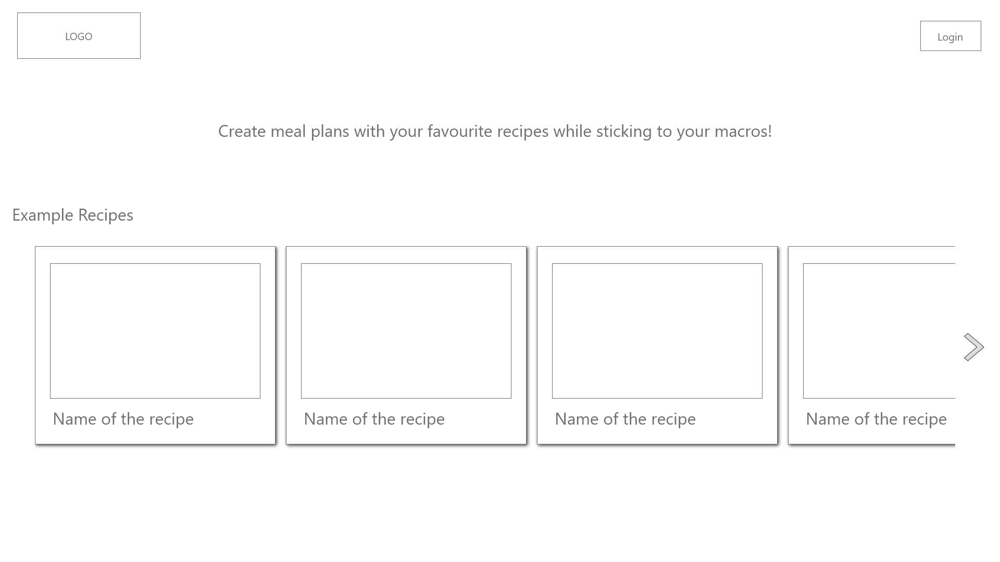
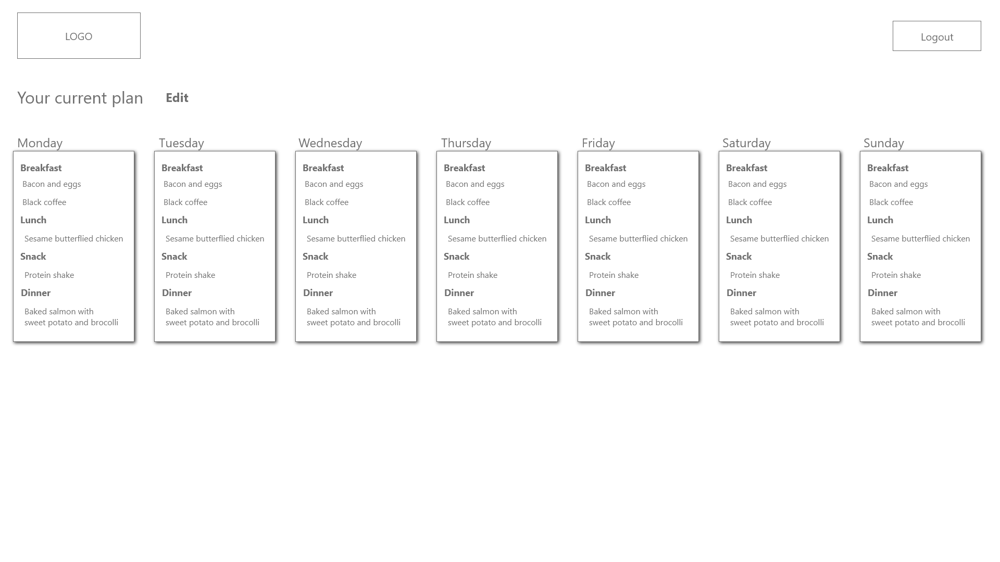
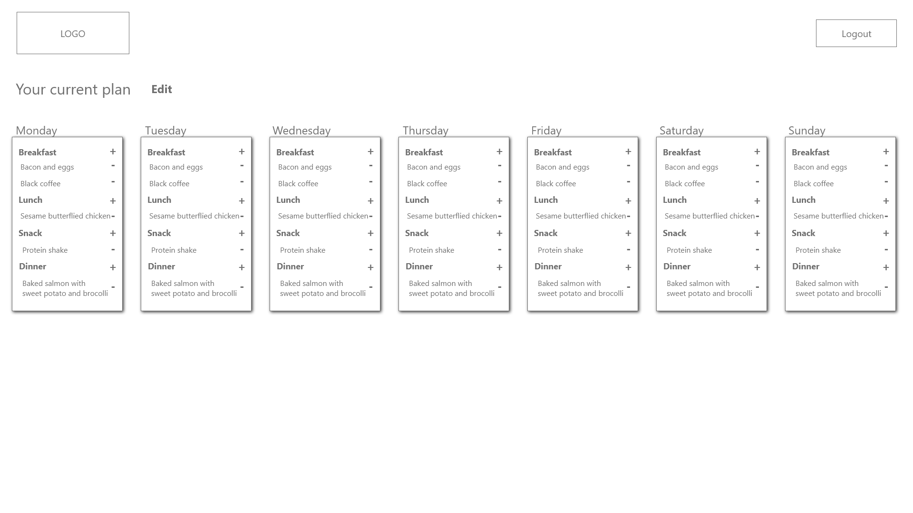
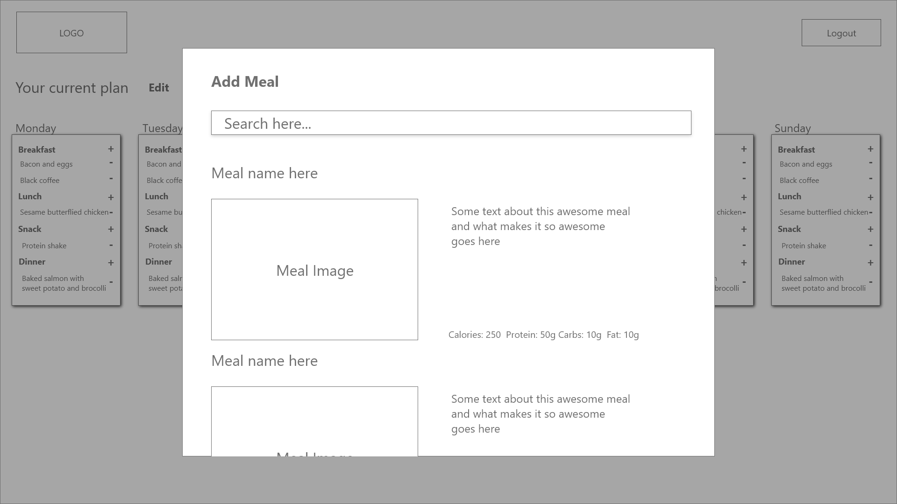

# Meal Planner

## Create a weekly meal plan to fit your macronutrient goals

Meal planner is used to add recipes including macronutrient data into a weekly meal plan to simplify calorie/macro tracking.
Users are able to log in to see their current plan and make changes.

### Wireframes

Home Page (Not logged in)

Home Page (logged in)

Edit Meal Plan

Add Meal
