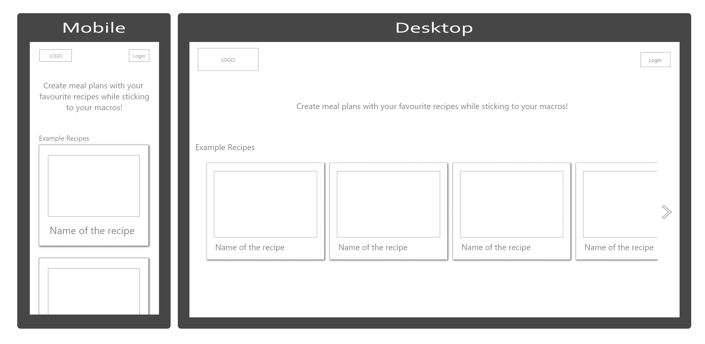
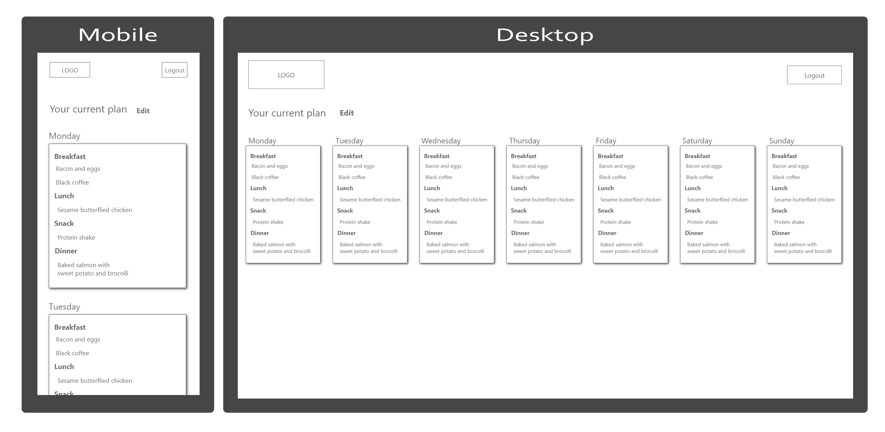
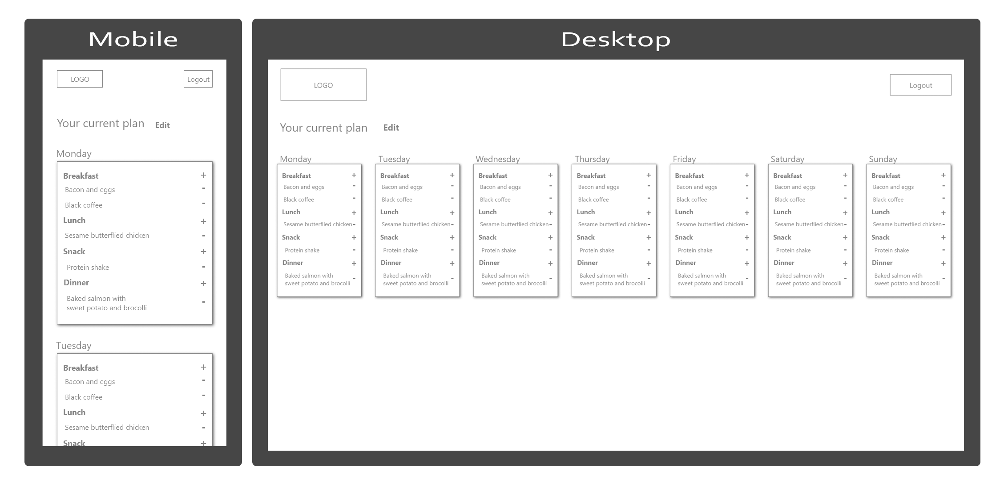
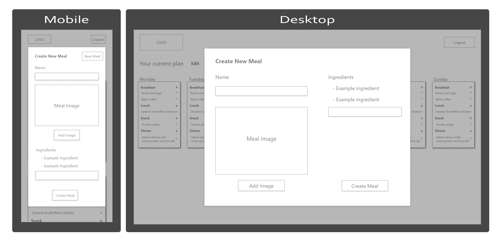

# Meal Planner

## Create a weekly meal plan to fit your macronutrient goals

Meal planner is used to add recipes including macronutrient data into a weekly meal plan to simplify calorie/macro tracking.
Users are able to log in to see their current plan and make changes.

[Click here to see the Trello board for this project!](https://trello.com/b/tFmgm0pU/meal-planner-app)

### Wireframes

Home Page (Not logged in)

Home Page (Logged in)

Edit Meal Plan

Add New Meal

### Set up

#### Requirements

- Python3.8
- Mypy
- Flake8
- Requests

#### Installation

- Clone the GitHub repository into a folder in your development environment and enter the project directory.

- Create a new virtual environment using the following command, note that SentAlysis requires Python 3.8

    `python3.8 -m venv venv`

    If you do not have the venv module installed, run `pip install venv` - this command can change depending on what versions of pip you have installed on your system.

- Activate your virtual environment using the following command:

    `source venv/bin/activate`

- Install the dependencies using the following command:

    `pip install -r requirements.txt`

- Now you're good to go! Open the app by running `python src/cmain.py`.

### CI Pipeline Overview

A Github Actions workflow is currently set up to run mypy, flake8 and the tests automatically when commits are pushed to Github. 

The workflow will run two jobs concurrently. Both will set up an Ubuntu environment, install Python3.8, clone the repository and create a virtual environment. From there, one job runs flake8 and mypy tests, with the other running the unittest tests. If all of the tests pass the workflow completes successfully.
